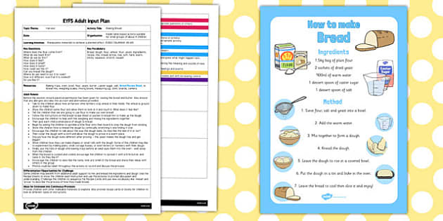

## Learning Design Patterns

Hearing about design patterns for the first time I thought it would be a reoccurring theme within code, like a motif. Then I remembered what class I was in and that something sounding like design patterns is a bit deceptive. Generally a design pattern is a common issue that has a general solution. So I guess I wasn't completely wrong, but I wasn't right either. 

Initially thinking about design patterns, I thought about following a recipe because design patterns are solutions thought up by people who have faced these repetitive issues and passed down their knowledge to everyone who will face these issues eventually. Similarly to a recipe, someone created a solution to making a certain dish and shared it with people that want to know how to make that dish. Both recipe and design patterns help resolve issues by providing a way to work out a problem. 

## Following the Recipe

Expanding on connecting a recipe to a design pattern. In this case lets say the food being the program we want to create, and the recipe guiding us to the end product. For example if you were to make bread for the first time from scratch without following a recipe it would be probably be terrible. Somethings just wouldn't work out like maybe the dough would be sticking everywhere, then come to find out you could use flour or oil to help the dough not stick. Functions and tips already exist for these common issues that we all face, so finding a recipe to what we want can be crucial to getting to the end goal.

The picture above shows a recipe with instructions on how to make bread. Similarly there will be notes and documents on the various types of design patterns and how to use them and what they do. The recipe/documentation is key to understanding how to get to the end goal, and provides a greater understanding to the reader.

## My Experience of Following the Recipe

Prior to learning about design patterns, I never knew I was already using them. In many of my computer science courses, they would cover general concepts and apply them to code without really telling why it works the way it does. An example of this is using the idea of classes in C and javascript, were we can use them to pass information around. These everyday design patterns that I never realized where design patterns, help ease the curve of learning how to code and gives a lot of options to making interesting code. Although the use of a design pattern brings complexity, that also means bringing more potential to what the code can do. Once the learning curve is passed, it's a matter of what I can do with what I learned.