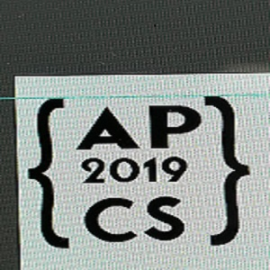

*"You don't have to be good to start... you just have to start to be good!", Joe Sabah*

## How I Started

As my junior year comes to an end I was left with the question, what do I want to study after high school? 
At this point of my life I didn't have anything that was interesting and in my opinion worth pursuing or studying, but I knew I had to go to college. 
Knowing this and my last year of high school approaching me I decided to take a few classes that interested me, one of them being AP Computer Science. 
I previously haven't had any experience with coding and wasn't the best student at the time, but I was curious and excited to learn. 
My entire expirence in that class was a constant struggle, lagging behind my class and not understanding the concepts wasn't the nicest experience. But my fellow peers and instructor motivated and supported me during my low points of the class. Bringing me to today and why I am continuing to pursue computer science.

## How it's Going

As I continue my studies in computer science I wish to expand my horizon of the world that is computer science. All the classes that I've taken up to this point, I'd say is to help build coding skills and really understand a language but now I want to see what other opportunities and paths there are within computer science.
With different branches like software enginnering, web development, cyber security, etc... I want to find what I'm really interested in and hopefully pursue what interests me.
Software enginnering is also so versatile in the sense that it can connect to many different careers and jobs that it would be best to learn as much software engineering skills as possible.

## Hopes for the Future

Now my hopes for the future, is to take all the lessons and skills what I will acquire during my time in college and be able to help others.
With software engineering I hope to build many different skills and be able to create ways to help others through coding or even branch out into another career through software engineering.
Whatever way life may take me I want to be able to help otehrs with my knowledge and skills like my peers and instructor did for me when I first started my journey into computer science.

