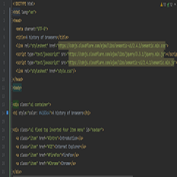

## My First Website!

So far in my computer science journey I've really only written fairly basic programs in java and C, which are important but lacking in activity. What I mean by this is I can make a program but it would just be a wall of text. With no user interface it leaves the coding looking very unattractive, I mean look at the left image then look at the right image which one looks more appealing. 

So far as I continue to learn more and more I find myself enjoying code again. In highschool when I first learned how to code in java I enjoyed the lessons, and through the struggle I would figure out the solution and get that feeling of achievement. However while the pandemic was at an all time high and we had to learn via online classes, my motivation to code suffered dramatically. Finding the solution didn't give the same feeling of achievement like it did before and I even questioned if I wanted to continue with computer science. In my ICS 314 class that feeling of finding the solution came back, while learning html and css with semantic ui. Recreating websites and being able to see what I've coded brought back that feeling of joy. Now that I've made my very first website, it feels great even if it looks like something from the early 2000's, just knowing that it's possible for me has motivated me again to try hard.

## Rough around the edges, but it's a start

Not to be shallow, but in the virtual world I believe how things look are very important. For example looking at the first website I created above, it isn't terrible but no one would every use that website. Saying it looks out of date is an understatement but for pure html and css it's passable. Now with the help of semantic ui you get somethings completely different

With just a few extra lines of code you can basically make your very own website from nothing. Although I had my doubts on if I could even make an image appear on the screen, I believe the time invested into learning how to use semantic ui with html and css was worth it because of the end product. 

## Building up

ok ok ok

