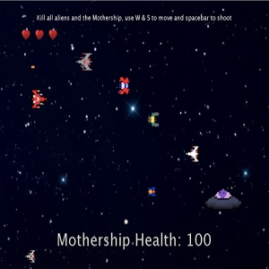

The final project assigned in ICS 111 was to work in a gorup to create a game. Previously the projects were solo, but now having to work in a group setting was different. The ideas could be bigger and more complex but we had to be able to work with others to make that possible. At the time I never worked with another person to complete a coding task and so I was nervous. With low confidence and no idea what to do I just started. Working with my partners we talked and brainstormed ideas and ended with the idea to create a game inspired by the already existing game galaga.

I believe we all were a bit anxious to complete this final project becasue it is an introductory course and here we are trying to create a game. None the less we focused and took everything in steps. Splitting up what we needed, I was assigned to make a bullet class which is what both the player and computer would be using to fire at each other. This class included the bullet visual, bullet speed and sound effects. Along with this I made the main class to run the game.

Reflecting on this final project, I learned how to work and collaborate with others in a team like setting. Although this project is probably at a smaller scale compared to a normal setting, I still got to experience working with others and having to combine my work with my partners. 
 
Source: <a href="https://github.com/Scott-Yuk/Final"><i class="large github icon"></i>Code</a>

You can see testing and game play at [Video](https://youtu.be/k3Xa0vbvvQI).
